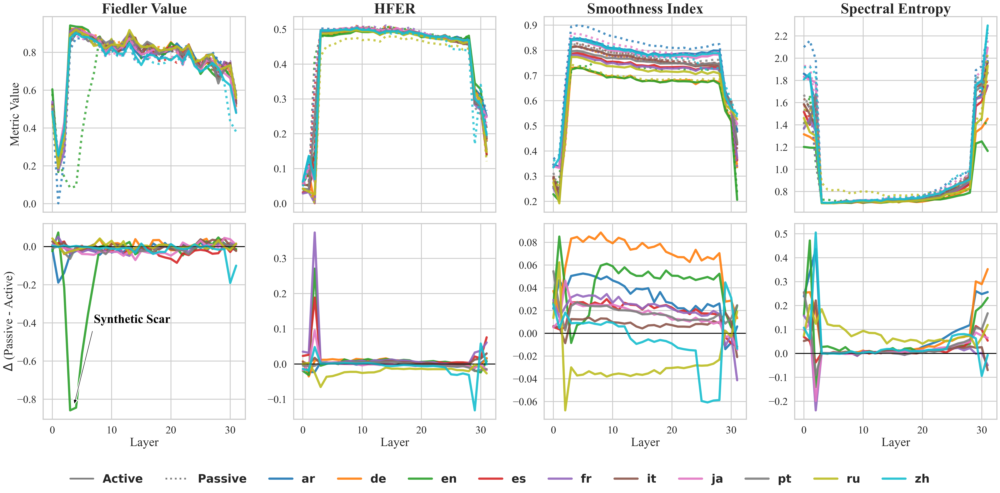
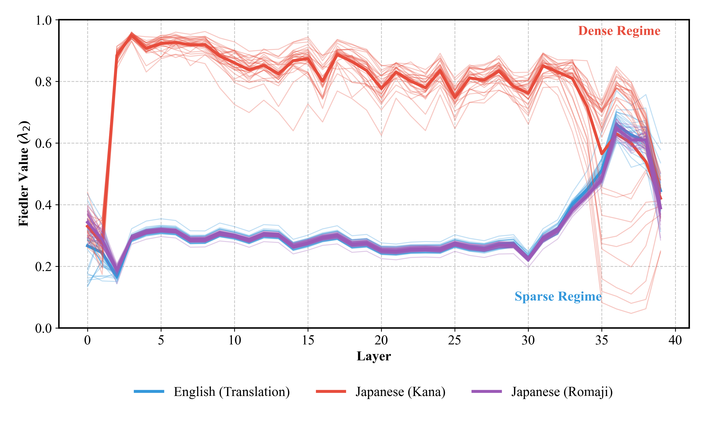

# The Geometry of Reason
### Spectral Diagnostics for Large Language Models



## Abstract
This repository contains the code, data, and reproduction scripts for **"The Geometry of Reason"**, a research initiative investigating the spectral topology of Large Language Model (LLM) attention graphs. By analyzing the eigenvalues of the graph Laplacian (Spectral Graph Theory), we uncover hidden pathologies in synthetic models and fundamental laws of linguistic processing.

## Key Findings

### 1. The "Synthetic Scar"
We identify a latent pathology in Phi-3 models caused by RLHF/Distillation overfitting.
*   **Observation**: A complete collapse of the attention graph's Fiedler Value ($\lambda_2 \to 0$) in early layers.
*   **Trigger**: Syntactic complexity, specifically **Passive Voice** structures.
*   **Consequence**: "Signal Death"—the model loses global context integration, reverting to unigram-like processing.
*   **Status**: Present in Phi-3. Cured in Phi-4.

### 2. The Tokenization Topology Law
We discover that a model's "reasoning shape" is physically determined by the density of its tokenization.
*   **Experiment**: A "Script Swap" control comparing Japanese (Kana), Romanized Japanese (Romaji), and English.
*   **Result**: 
    *   **Dense Script (Kana)** $\to$ Global Integration ($\lambda_2 \approx 0.80$).
    *   **Sparse Script (Romaji)** $\to$ Modular Processing ($\lambda_2 \approx 0.25$).
*   **Conclusion**: Topology is a property of the **Token Stream**, not the Semantic Language Identity.



## Installation

### Dependencies
```bash
pip install -r requirements.txt
```

### Core Library
This work powers the open-source library `spectral-trust`.
```bash
pip install spectral-trust
```
Use `spectral-trust` for production-grade implementation of these metrics. This repository serves as the research testbed.

## Reproducibility

### Option 1: Visualize Pre-Computed Results (Recommended)
The repository includes pre-computed results in `results/`. Open the Jupyter Notebooks to explore:
```bash
jupyter notebook notebooks/01_Syntactic_Integrity.ipynb
jupyter notebook notebooks/02_Tokenization_Topology.ipynb
```

### Option 2: Re-Run Experiments from Scratch (GPU Required)
Use the `reproduce.py` CLI to regenerate results:
```bash
# Synthetic Scar (Passive Voice Collapse)
python scripts/reproduce.py --experiment scar --model Phi-3

# Tokenization Topology Law (Script Swap)
python scripts/reproduce.py --experiment topology --model Phi-4 --quant-4bit
```
Results will be saved to `output_reproduce/`.

### Option 3: Custom Analysis
Run spectral analysis on any model and text:
```bash
python scripts/analyze.py --model microsoft/phi-4 --text "Your text here" --results-file output/my_results.json
```

## Citation
If you use this work, please cite:
```bibtex
@article{noel2026spectralfingerprints,
  title={Spectral Fingerprints of Training: Detecting Data Composition from Attention Geometry},
  author={Valentin Noël},
  journal={Under Review},
  year={2026}
}
```

## License
MIT
